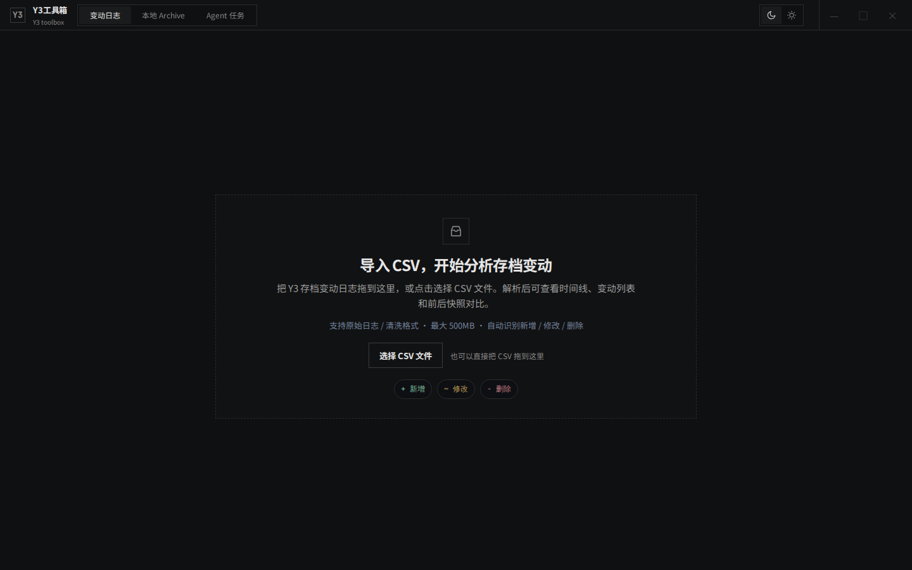
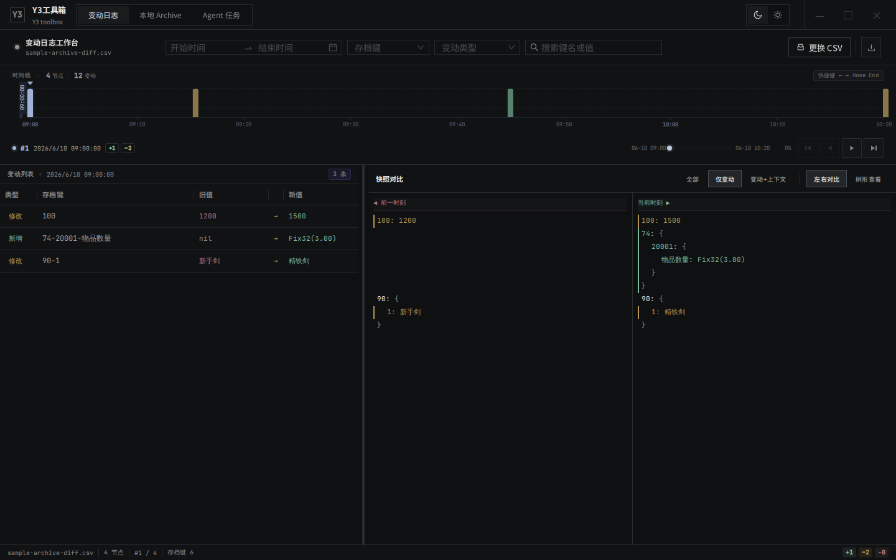
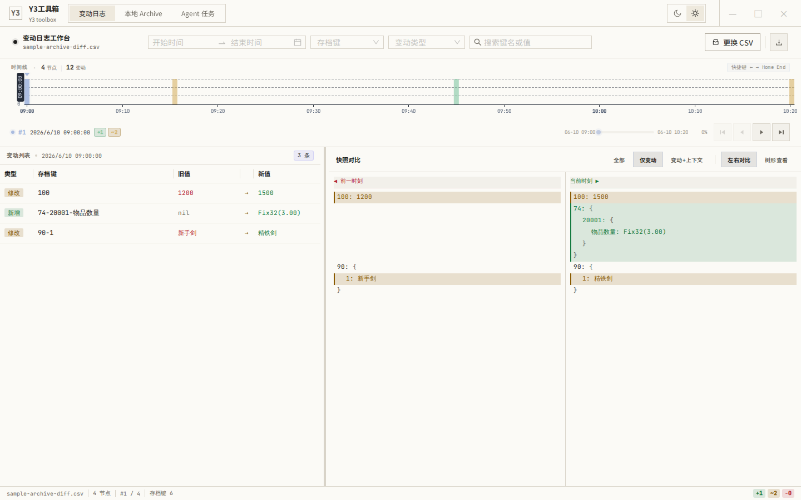
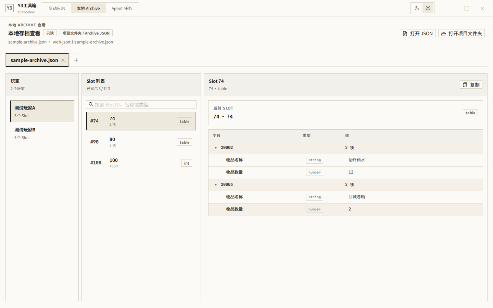

# y3工具箱

`y3工具箱` 是面向 Y3 游戏服务器存档排查的桌面工具。它以 **Electron 桌面应用** 为主线，帮助你导入存档变动 CSV 或本地 Archive 数据，查看时间线、变动列表和前后快照差异。



## 下载应用

普通用户请从 **GitHub Releases** 下载正式发布包。下载 Windows 可执行文件后双击运行即可。

## 功能截图

### 变动日志工作台

导入包含 `archive_diff` 的 CSV 后，工作台会生成时间线、变动列表、快照对比和状态栏统计。你可以按时间范围、存档键、变动类型或关键词筛选，并下载整理后的 CSV。



### 纸面主题

界面提供深灰和纸面两种主题，便于在演示、长时间排查或截图归档时切换阅读环境。



### 本地 Archive 查看

本地 Archive 页面支持打开单个 Archive JSON 或 Y3 项目目录，以只读方式浏览玩家、Slot 列表和结构化 Slot 详情。



## 你可以用它做什么

- **分析存档变动日志**：导入包含 `archive_diff` 的 CSV，自动识别 `create` / `update` / `delete` / `noop`。
- **查看本地 Archive**：打开 Y3 项目的 Archive JSON 或项目目录，按玩家/槽位查看本地存档结构。
- **对比快照变化**：生成时间线、变动列表和前后快照对比，快速定位某个 key 在什么时间发生了变化。
- **切换阅读主题**：在深灰 / 纸面主题之间切换，适配暗色排查和浅色文档截图。

## 快速开始：运行桌面应用

如果你只是使用应用，优先下载 Releases 中的 Windows 可执行文件并双击运行。

如果你需要从源码启动开发版：

```bash
npm ci
npm run dev:electron
```

## 导入数据

### 变动日志 CSV

在 **变动日志** 页面点击“选择 CSV 文件”，或把 CSV 拖到页面中间的导入卡片。CSV 可以是包含 `archive_diff` 的原始日志导出、清洗后的变动数据，或包含 `matched_log_raw` 的检测结果 CSV。

支持重点：

- 原始日志 / 清洗格式。
- 最大 500MB。
- 自动识别 `create` / `update` / `delete` / `noop`。
- 支持下载整理后的 clean CSV。

### 本地 Archive JSON / 项目目录

切换到 **本地 Archive** 页面后，可以打开单个 Archive JSON，也可以打开 Y3 项目文件夹。该入口用于只读查看本地存档结构，不会修改你的项目文件。

### Agent 任务中心

任务中心会连接应用配置的任务服务，用于提交拉取日志或导出资源等任务。普通用户只需要从 Releases 下载应用并按页面提示填写参数；如果任务服务不可用，页面会显示当前服务/队列状态。

## 页面导览

| 页面 | 用途 | 适合场景 |
|---|---|---|
| 变动日志 | 导入 CSV 并分析 `archive_diff` 时间线和快照差异 | 已拿到存档变动 CSV |
| 本地 Archive | 打开 Archive JSON 或项目目录，查看本地存档结构 | 本机已有存档文件或项目目录 |

## 开发者命令

```bash
npm run dev:electron # Electron 桌面开发模式
npm run build        # TypeScript 类型检查 + Vite 生产构建
npm run build:electron # 构建并打包 Electron 应用
npm run pack:win     # 打包 Windows 可执行文件
npm run lint         # ESLint 检查
npm run test         # Vitest 测试
npm run preview      # 本地预览生产构建
```

## 项目结构速览

- `electron/main.ts` — Electron 主进程：窗口、IPC、本地文件读取、Archive 输入读取。
- `electron/preload.ts` — 安全桥接 `window.electronAPI`。
- `src/parser/` — CSV 与 archive diff 解析。
- `src/engine/` — 快照和 diff 行构建。
- `src/components/` / `src/hooks/` — React UI 与状态管理。
- `src/archiveViewer/` — 本地 Archive 查看。
