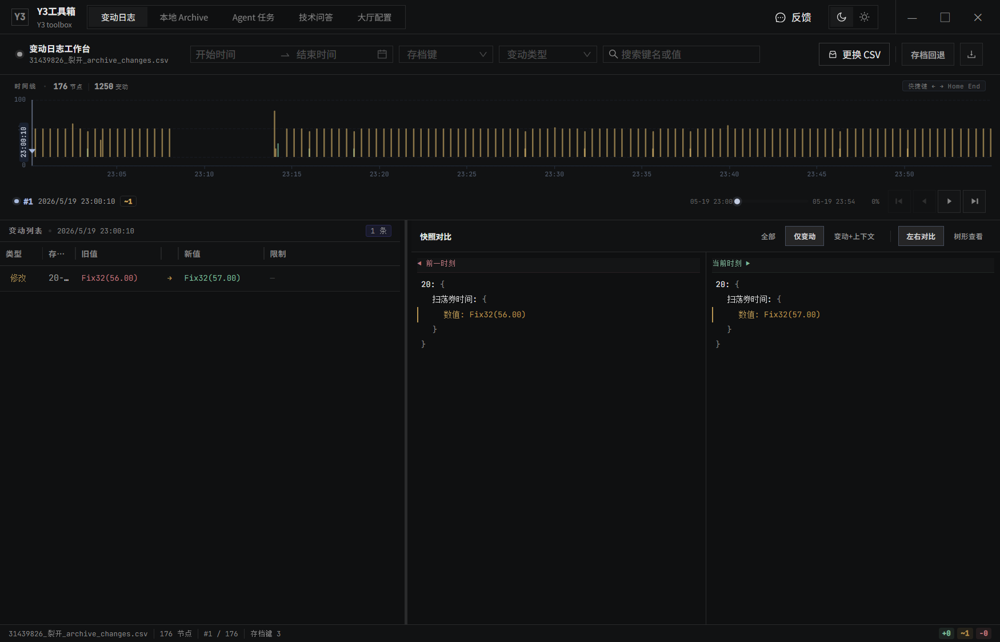
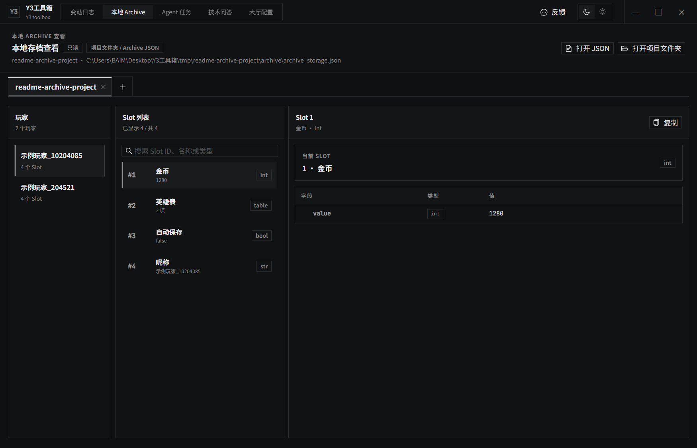
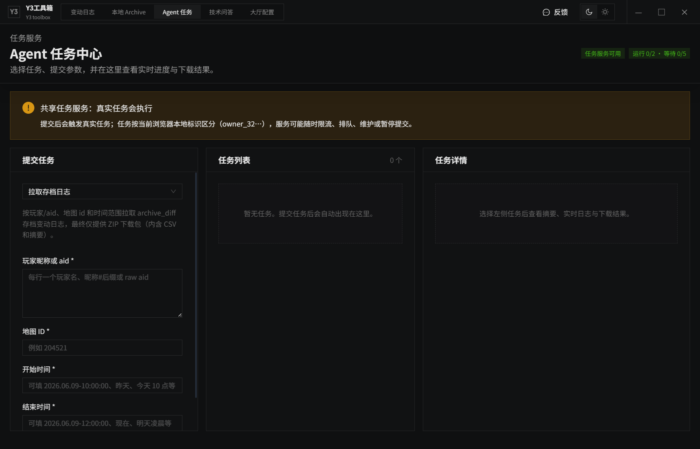
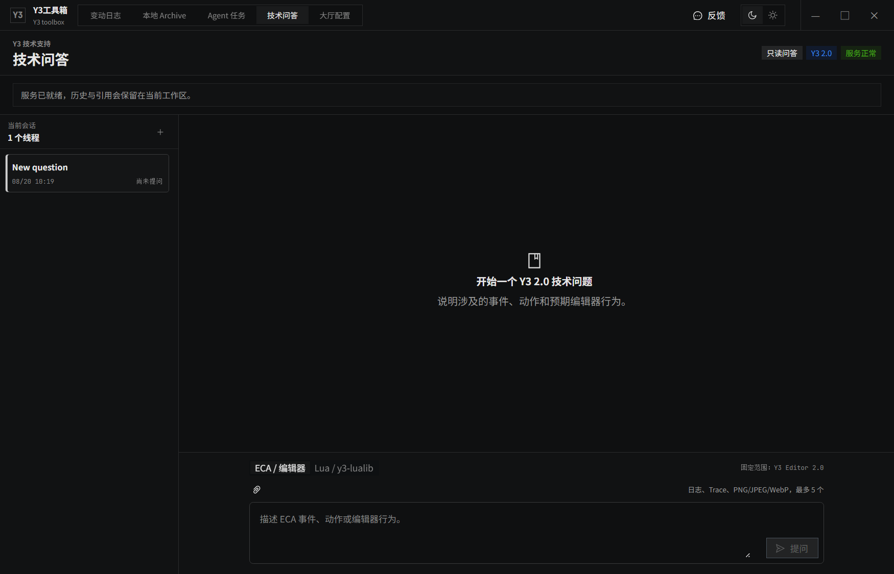
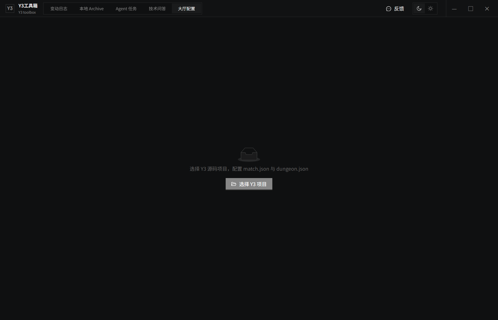
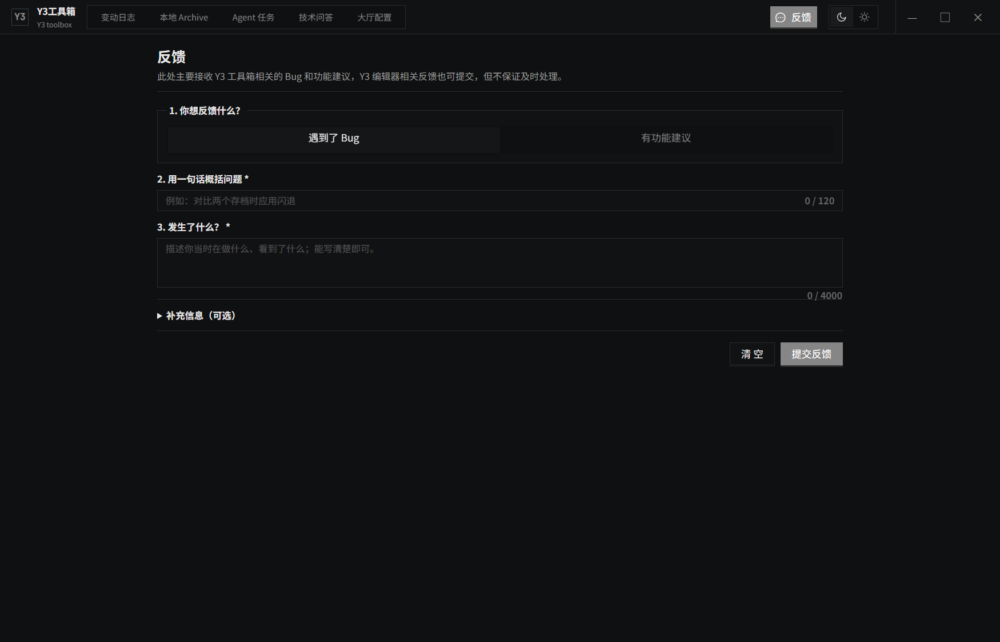
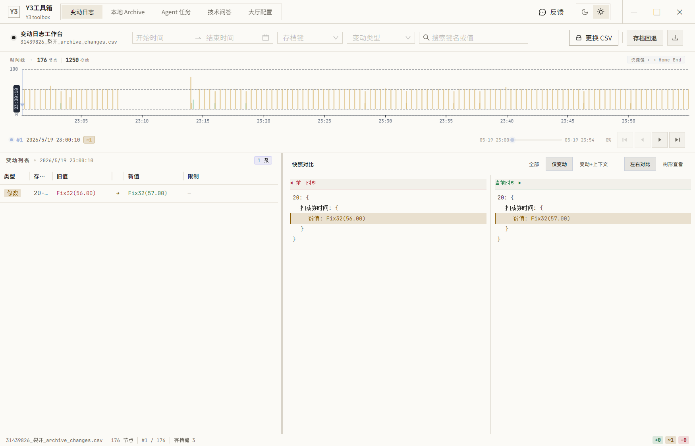
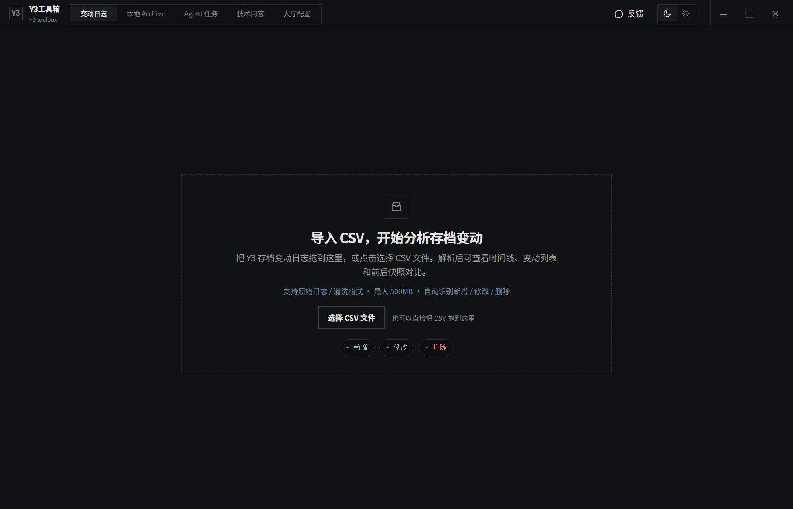

# Y3 工具箱

`Y3 工具箱` 是一个面向 Y3 地图作者、玩法脚本作者和技术排查人员的 Windows 桌面工具。它把本地存档诊断、任务服务、技术问答、大厅配置和反馈入口放在同一个工作区里，目标是让“查一份日志、看一个 Archive、问一个 ECA/Lua 问题、改一份大厅配置”这些高频操作都能在桌面端完成。

应用以 Electron 桌面端为主线。本地 CSV / Archive / 大厅配置能力不依赖在线服务；Agent 任务中心、技术问答和反馈功能会连接各自独立的服务边界。

## 下载应用

普通用户请从 **GitHub Releases** 下载正式发布包。下载 Windows 可执行文件后双击运行即可。

当前客户端采用提示式更新：当 Agent 任务中心检测到共享任务服务要求更高的客户端版本时，会暂停新的任务提交并给出 Releases 下载入口；已有的任务列表和结果仍可查看，本地 CSV / Archive / 大厅配置查看功能不受影响。

## 功能截图

### 变动日志工作台

导入包含 `archive_diff` 的 CSV 后，工作台会生成时间线、变动列表、前后快照对比和状态栏统计。你可以按时间范围、存档键、变动类型或关键词筛选，下载整理后的 CSV，也可以基于目标时间生成可审核的存档回退 JSON 输入。



### 本地 Archive 查看

本地 Archive 页面支持打开单个 Archive JSON 或 Y3 项目目录，以只读方式浏览玩家、Slot 列表和结构化 Slot 详情，不会修改你的项目文件。



### Agent 任务中心

任务中心用于提交共享任务服务中受控范围的任务，例如拉取存档变动日志、拉取不同步日志、导出 kkres 高分辨率图片资源，并在这里查看实时进度、执行日志和下载产物。



### 技术问答

技术问答是独立的 Y3 Editor 2.0 问答工作区，覆盖 `ECA / 编辑器` 和 `Lua / y3-lualib`。回答由服务端模型结合受治理的证据生成，并支持引用来源、诊断附件、取消与重试。



### 大厅配置

大厅配置从选定的 Y3 源码项目读取 `match.json` 与 `dungeon.json`，提供副本进入设置、匹配规则、分数段、阵营人数等编辑能力，并在写入前做校验、预览和关闭编辑器确认。



### 反馈

反馈是独立的匿名入口，用于提交工具箱相关的 Bug 和功能建议；Y3 编辑器相关问题也可提交，但不保证及时处理。



### 纸面主题

界面提供深灰和纸面两种主题，便于在演示、长时间排查或截图归档时切换阅读环境。



## 页面导览

| 页面 | 用途 | 适合场景 |
|---|---|---|
| 变动日志 | 导入 CSV 并分析 `archive_diff` 时间线、快照差异和回退输入 | 已拿到存档变动 CSV |
| 本地 Archive | 打开 Archive JSON 或项目目录，只读查看本地存档结构 | 本机已有存档文件或项目目录 |
| Agent 任务 | 提交固定范围的共享服务任务并查看结果与下载产物 | 拉取日志、导出 kkres 资源 |
| 技术问答 | 询问 Y3 Editor 2.0 的 ECA 或 Lua 技术问题 | 查用法、定位问题或分析诊断材料 |
| 大厅配置 | 编辑并安全写入 `match.json` 与 `dungeon.json` | 调整副本、匹配规则和房间设置 |
| 反馈 | 提交 Bug 或功能建议 | 报告问题或描述改进期望 |

## 快速开始：运行桌面应用

如果你只是使用应用，优先下载 Releases 中的 Windows 可执行文件并双击运行。

如果你需要从源码启动开发版：

```bash
npm ci
npm run dev:electron
```

## 各功能入口

### 变动日志 CSV

在 **变动日志** 页面点击“选择 CSV 文件”，或把 CSV 拖到页面中间的导入卡片。CSV 可以是包含 `archive_diff` 的原始日志导出、清洗后的变动数据，或包含 `matched_log_raw` 的检测结果 CSV。



支持重点：

- 原始日志 / 清洗格式。
- 最大 500MB。
- 自动识别 `create` / `update` / `delete` / `noop`。
- 支持下载整理后的 clean CSV。
- 支持生成存档回退输入：默认使用文件名作为玩家标识；如果原始日志中可读取 `aid`，导出会保留该来源。回退输入只包含日志能证明的字段，不会凭空补全缺失槽位字段，也不会修改任何存档文件。

### 本地 Archive JSON / 项目目录

切换到 **本地 Archive** 页面后，可以打开单个 Archive JSON，也可以打开 Y3 项目文件夹。该入口用于只读查看本地存档结构，不会修改你的项目文件。

### Agent 任务中心

任务中心会连接应用配置的任务服务，用于提交固定范围的任务并查看进度。普通用户只需要从 Releases 下载应用并按页面提示填写参数；如果任务服务不可用，页面会显示当前服务/队列状态。任务中心还会读取服务端公开的 release 兼容信息：客户端过旧、兼容信息缺失或异常时，已有任务列表和结果仍可查看，但新的任务提交会被禁用并提示下载最新版本。

任务中心当前覆盖以下用户任务：

- 拉取存档变动日志。
- 拉取不同步日志。
- 导出 kkres 高分辨率图片资源。

`导出 kkres 图片` 任务会把本机图片先上传到暂存区，再把 `staging:` 标识交给任务服务；不会把本机路径、Token 或项目目录上传给任务服务。请在导入正式项目前先导入测试项目确认资源管理器和 UI 编辑器显示正常，并做好项目备份。

### 技术问答

`技术问答` 独立于 Agent 任务中心，是 Y3 Editor 2.0 问答工作区。每次回答都会由服务端模型结合受治理的证据生成，不会把检索结果直接当作答案。

使用范围、附件限制、回答状态和明确不支持的能力见 [技术问答使用说明](docs/technical-qa.md)。

### 大厅配置

`大厅配置` 只读取所选 Y3 源码项目的大厅配置，并且只写入 `match.json` 和 `dungeon.json`。工具不会创建持久备份；写入前请自行备份项目，并确认已完全关闭 Y3 编辑器，因为编辑器运行时会用内存中的旧配置覆盖外部修改。

详细使用方式见 [大厅配置使用说明](docs/lobby-config.md)。

### 反馈

`反馈` 是独立的匿名入口，主要用于接收 Y3 工具箱相关的 Bug 和功能建议。提交成功只表示反馈已收到，不会返回工单号、状态追踪链接或处理进度承诺。

详细说明见 [反馈使用说明](docs/feedback.md)。

## 开发者命令

```bash
npm run dev:electron # Electron 桌面开发模式
npm run build        # TypeScript 类型检查 + Vite 生产构建
npm run build:electron # 构建并打包 Electron 应用
npm run pack:win     # 打包 Windows 可执行文件
npm run lint         # ESLint 检查
npm run test         # Vitest 测试
npm run preview      # 本地预览生产构建
```

## 项目结构速览

- `electron/main.ts` — Electron 主进程：窗口、IPC、本地文件读取、Archive 输入读取、大厅配置读写。
- `electron/preload.ts` — 安全桥接 `window.electronAPI`。
- `src/parser/` — CSV 与 archive diff 解析。
- `src/engine/` — 快照和 diff 行构建。
- `src/components/` / `src/hooks/` — 变动日志工作台 UI 与状态管理。
- `src/archiveViewer/` — 本地 Archive 查看。
- `src/recovery/` — 存档回退输入生成与预览。
- `src/agentJobs/` — Agent 任务中心、任务状态和产物下载。
- `src/technicalQa/` — Y3 Editor 2.0 技术问答工作区。
- `src/lobbyConfig/` — 大厅配置编辑、校验与写入。
- `src/feedback/` — 匿名反馈表单与附件处理。
